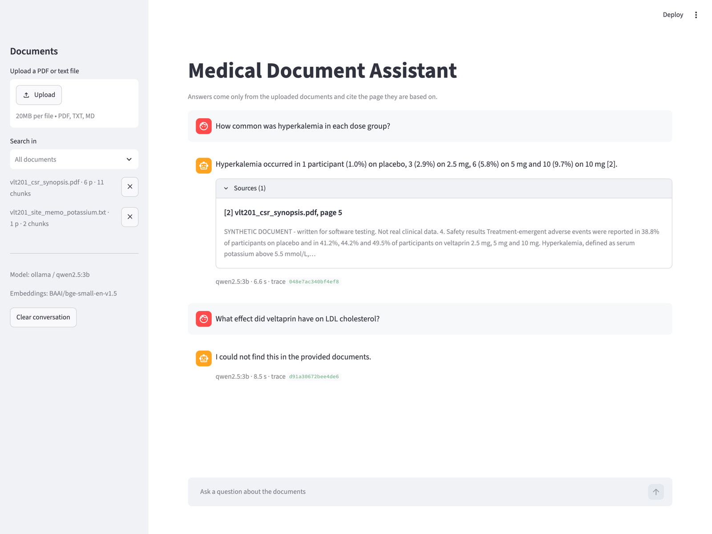

# Medical Document Assistant

A local prototype that lets a researcher upload clinical documents (PDF or plain text), ask questions about them, and get answers that cite the page they come from.

It runs entirely on a laptop by default: a local LLM through Ollama, local embeddings, and a local vector store. Nothing is sent to an external service unless you switch the LLM provider to Claude.

```
$ curl -s localhost:8000/ask -H "X-API-Key: dev-key-change-me" -H "Content-Type: application/json" \
    -d '{"question": "How common was hyperkalemia in the 10 mg group?"}'

{
  "answer": "Hyperkalemia occurred in 9.7% of participants in the 10 mg group [3].",
  "citations": [{"ref": 3, "filename": "vlt201_csr_synopsis.pdf", "page": 5, "snippet": "...", "score": 0.76}],
  "grounded": true,
  "unsupported": [],
  "trace_id": "e0e58a5a6fc44305",
  "model": "qwen2.5:3b",
  "latency_ms": 5244
}
```



## Contents

- [Quick start](#quick-start)
- [What is in here](#what-is-in-here)
- [How a question is answered](#how-a-question-is-answered)
- [Design decisions](#design-decisions)
- [Evaluation](#evaluation)
- [Limitations and what I would do next](#limitations-and-what-i-would-do-next)

## Quick start

You need Python 3.10 or newer and [Ollama](https://ollama.com).

```bash
# 1. the local model (1.9 GB)
ollama pull qwen2.5:3b

# 2. dependencies, into .venv, and a .env file copied from .env.example
make install                      # or: make install PYTHON=python3.12

# 3. the API, on http://localhost:8000 (interactive docs at /docs)
make api

# 4. in a second terminal: the chat UI, on http://localhost:8501
make ui
```

The first start downloads the embedding model and the reranker (about 150 MB together) and takes a little longer. `make ui` does not open a browser by itself; go to http://localhost:8501.

Two sample documents are in `samples/`: a six-page study report synopsis (PDF) and a site memo (text). Both are invented for this project and say so on every page. Upload them in the UI, or:

```bash
KEY="X-API-Key: dev-key-change-me"
curl -H "$KEY" -F "file=@samples/vlt201_csr_synopsis.pdf" localhost:8000/documents
curl -H "$KEY" -F "file=@samples/vlt201_site_memo_potassium.txt" localhost:8000/documents
curl -H "$KEY" -H "Content-Type: application/json" localhost:8000/ask \
     -d '{"question": "Which dose was chosen for Phase 3 and why?"}'
```

Questions to try: *What was the primary endpoint?* · *How many participants completed the study?* · *At what potassium value must treatment be interrupted?* · *What effect did the drug have on LDL cholesterol?* (not in the documents, so it should say so).

Other commands:

| | |
|---|---|
| `make test` | 40 unit and API tests. Offline, about a second: the LLM and the embedder are replaced by fakes. |
| `make eval` | Runs the evaluation set against the real pipeline (needs Ollama, about two minutes). |
| `make mcp` | Starts the MCP server on stdio. `python scripts/mcp_smoke.py` connects to it as a client. |
| `make lint` | ruff. |

### Using Claude instead of a local model

```bash
# in .env
MDA_LLM_PROVIDER=anthropic
ANTHROPIC_API_KEY=sk-ant-...
```

The Claude client (`app/llm/anthropic_client.py`) is written against the current SDK, but I did not have an API key while building this, so only the Ollama path has been run end to end. Everything else is identical for both providers.

## What is in here

```
app/
  main.py               FastAPI app: request ids, access log, error mapping
  api/                  routes, request/response schemas, API-key dependency
  ingestion/            loaders (PDF, text) -> page-aware chunking -> ingestion service
  retrieval/            embeddings, Chroma vector store, retriever (dense + reranking)
  prompts/              prompt registry + versioned YAML templates
  context/              ContextBuilder: the one place where model input is assembled
  agent/                the LangGraph flow and the citation check
  llm/                  LLM interface with an Ollama and a Claude implementation
  observability/        JSON logging, per-question traces
  mcp_server.py         the same capabilities exposed over the Model Context Protocol
  qa.py, storage.py, container.py, config.py
ui/streamlit_app.py     chat UI, talks to the API only
eval/                   evaluation set, runner, and the results of each iteration
tests/
samples/                synthetic demo documents (scripts/make_sample_docs.py generates them)
```

Endpoints (all except `/health` need the `X-API-Key` header):

| | | |
|---|---|---|
| `GET` | `/health` | provider, model, number of documents |
| `POST` | `/documents` | upload a PDF or text file; re-uploading the same file returns the existing record |
| `GET` | `/documents` | list |
| `DELETE` | `/documents/{id}` | remove the document, its chunks and its file |
| `POST` | `/ask` | question, optional `document_ids` to narrow the search, optional `history` for follow-ups |
| `GET` | `/traces`, `/traces/{id}` | what happened for a given answer |

## How a question is answered

```
                 Streamlit UI        curl / scripts        MCP client (Claude Desktop, agents)
                      |                    |                           |
                      +------ HTTP --------+                         stdio
                                 |                                     |
                         FastAPI (API key)                        MCP server
                                 |                                     |
                                 +----------------+--------------------+
                                                  |
                                              QAService  ---------> trace (JSONL)
                                                  |
        +-----------------------------------------------------------------------------+
        |  LangGraph                                                                   |
        |                                                                              |
        |  rewrite_query -> retrieve -+-> generate -> check_citations -> answer        |
        |                             |                                                |
        |                             +-> no_context ("not in the documents")          |
        +-----------------------------------------------------------------------------+
               |               |                |
            LLM client     Retriever       ContextBuilder  <- PromptRegistry (YAML)
          Ollama | Claude       |
                     Chroma + embeddings + cross-encoder
```

1. **rewrite_query** – only when there is conversation history. A follow-up like "and in the placebo group?" is rewritten into a standalone question, because that is what gets searched.
2. **retrieve** – embedding search for 20 candidates, a cross-encoder re-orders them, the best 5 are kept. If even the best hit is not similar to the question, the flow goes to **no_context** and returns "I could not find this in the provided documents." without calling the model.
3. **generate** – `ContextBuilder` assembles the system prompt, the list of documents, the numbered sources and the question. The model answers with `[n]` markers.
4. **check_citations** – every cited sentence is compared with the sources that were actually shown.
   - If another source clearly supports the sentence better than the one the model cited, the marker is moved to that source, so the reader gets the right page.
   - If a sentence contains a number that is in none of the passages it cites, or cites an id that does not exist, or the answer has no citation at all, the response gets `grounded: false`, the sentence is listed under `unsupported`, and the UI shows a warning with that sentence.

Ingestion is a straight pipeline: hash the file (duplicates are skipped) → extract text per page → chunk → embed → store chunks in Chroma, metadata in SQLite, the extracted pages as JSON.

## Design decisions

### Retrieval

- **Chunks never cross a page.** A chunk is a run of whole sentences up to 900 characters with about 150 characters of overlap. Keeping chunks inside one page loses a little recall when a sentence runs across a page break, but a citation can always name one exact page, and for this use case being able to check the source matters more.
- **Local embeddings through fastembed** (`bge-small-en-v1.5`, ONNX). No torch install, no API key, and document text stays on the machine. The embedder sits behind a two-method interface, so changing the model is a config change and a domain-specific model would be a small class.
- **Chroma** for the vector index because it persists to a folder and supports metadata filters, which is what "search only in these documents" needs. I compute embeddings myself rather than through Chroma's embedding hook so the two can be swapped independently.
- **SQLite for the document registry.** The vector store should not be the system of record for which documents exist. One file, no server, and a unique constraint on the content hash gives de-duplication for free.
- **Cross-encoder reranking** was not in the first version. I added it after the evaluation showed a retrieval miss; the story is in [Evaluation](#evaluation).
- **The relevance threshold is deliberately coarse.** I first wanted it to catch every unanswerable question. Looking at real scores showed that this cannot work: a question about LDL cholesterol (not in the document) scores 0.75 against these chunks, higher than several answerable questions, because everything is about the same drug. The threshold (0.5) only separates "about these documents" from "about something else". Questions on the topic but without an answer are handled by the prompt.

### Prompts

- Prompts are **YAML files with a name and a version** (`app/prompts/templates/`), rendered with Jinja. They are not f-strings scattered through the code. The version is written into every trace, so an answer can be tied to the prompt that produced it. Rendering uses `StrictUndefined`: a missing variable is an error, not an empty string in the prompt.
- **The system prompt is static.** It has no per-request data, so it is reusable (the MCP prompt serves the same text) and cacheable with providers that support prompt caching.
- What the system prompt asks for, and why:
  - answer only from the sources, and a fixed sentence when the answer is not there. A fixed sentence can be detected by code, which the evaluation and the citation check rely on;
  - numbers, doses and units copied exactly, never rounded or converted;
  - text inside the sources is treated as material to analyse, not as instructions (a cheap first line of defence against prompt injection through an uploaded document);
  - no medical advice. The assistant reports what a document says.
- The reasoning behind each prompt version is recorded in the template file itself. `qa_user` is at version 4. Two changes came out of the evaluation and one out of a wrong citation I saw in the UI.

### Context management and MCP

I read this requirement in two ways and tried to cover both.

**Inside the application**, `ContextBuilder` (`app/context/builder.py`) is the only place where model input is put together. It has four inputs, and each has one defined place:

| input | kind | where it goes |
|---|---|---|
| instructions | static | system prompt |
| document inventory | static per request scope | top of the user turn |
| retrieved passages | dynamic | numbered `[n]` sources, best first until the size budget is used, then put in reading order |
| conversation history | dynamic | last N turns, always starting with a user turn |

It returns a `ModelContext` with the messages and with the sources and their ids, so the citation check later knows exactly what the model was shown. New kinds of context (a glossary, patient metadata, tool results) would be added here and nowhere else.

**Towards other models and agents**, `app/mcp_server.py` is a Model Context Protocol server built on the official SDK. It exposes the same services as the HTTP API:

- tools: `search_documents` (raw passages with page and score), `ask_documents` (the full pipeline, with citations), `list_documents`
- resource: `document://{id}`, the extracted text with page markers
- prompt: `grounded_clinical_qa`, which reuses the system prompt

So an MCP client such as Claude Desktop, or a future orchestrating agent, can discover what this system offers and pull context on demand. To register it in a client:

```json
{
  "mcpServers": {
    "medical-docs": {
      "command": "/absolute/path/to/.venv/bin/python",
      "args": ["-m", "app.mcp_server"],
      "cwd": "/absolute/path/to/this/repo"
    }
  }
}
```

### Agent extensibility

The flow is a LangGraph `StateGraph` (`app/agent/graph.py`). Right now it has one branch, and I am aware a plain function could do the same. I used a graph because the things I would add next are graph shaped: a retry edge when the citation check fails, a router in front of several tools, a step that waits for human approval. Each is a new node and an edge.

LangGraph is used for orchestration only. The nodes are plain functions and the LLM, the retriever and the context builder sit behind small interfaces of my own, so there is no framework lock-in below the graph and every part can be tested without it.

### Observability

- **Structured logs**: one JSON object per line on stderr, with a request id that is also returned in the `X-Request-ID` header.
- **A trace per question**, appended to `data/traces.jsonl` and served by `GET /traces/{id}`: the search query after rewriting, every retrieved chunk with its score, which sources reached the model, prompt versions, model, token counts, the time each step took, the answer and the result of the citation check. Each graph node reports its own step through a small decorator.
- **The citation check** runs on every answer, not only offline. Its result (`grounded`, the sentences it could not support, any citation it moved) is in the response and in the trace. The trace also keeps the answer exactly as the model wrote it, next to the corrected one.
- **An evaluation script**, described below.

A JSONL file is obviously not a tracing backend. The trace is one plain dict created in one place (`QAService`), so sending it to Langfuse or OpenTelemetry instead would be a small change.

### API and security

- All routes except `/health` are behind an API key, checked in one FastAPI dependency with a constant-time comparison. A single shared key shows where authentication sits; real users would need OAuth2/JWT with identities, so that access to documents can be scoped and audited.
- Uploads are limited in size, the file type is checked, and the client's file name is reduced to its base name before it is used.
- Errors from the model backend become a 502 with a message that says what to do ("Ollama does not have model X. Run `ollama pull X`.").

### LLM choice

The default is a 3B model on Ollama. The reasons are practical: anyone can run the project without an account or a key, and clinical documents are the kind of data that often may not leave the machine. I compared the two small models I had locally on the evaluation set. `qwen2.5:3b` follows the output contract (citations, the fixed refusal sentence). `llama3.2:3b` paraphrased the refusal and attached citations to it, which broke 3 of the 4 unanswerable cases, so qwen is the default.

A model this small is the weakest part of the system and the remaining evaluation failures are its reading errors. Since the provider is one interface (`app/llm/base.py`), using a stronger model is a setting.

## Evaluation

`eval/dataset.jsonl` has 16 questions about the sample documents: 12 with a known answer and a known page, and 4 that the documents do not answer (three on the topic, one unrelated). `make eval` runs them through the same `QAService` the API uses and checks:

- **retrieval** – did the passage that holds the expected fact reach the model
- **answer** – does the answer contain the expected facts
- **cites right page** – does it cite the page those facts are on
- **grounded** – do all citation markers resolve to a real source, and are the numbers of each cited sentence in a passage it cites
- **refusal** – for unanswerable questions, did it say so

Results with `qwen2.5:3b` (full output of each run is in `eval/results/`):

| run | retrieval | answer | cites right page | grounded | refusal | passed |
|---|---|---|---|---|---|---|
| 1. embeddings only, first prompt | 11/12 | 10/12 | 5/12 | 5/12 | 4/4 | 8/16 |
| 2. + citation rule repeated after the question | 11/12 | 10/12 | 8/12 | 12/12 | 4/4 | 11/16 |
| 3. + cross-encoder reranking | 12/12 | 10/12 | 8/12 | 12/12 | 4/4 | 12/16 |
| 4. + sources labelled `[n]` instead of XML ids | 12/12 | 10/12 | 10/12 | 12/12 | 4/4 | 14/16 |
| 5. + page number hidden from the model, citation check | 12/12 | 10/12 | 11/12 | 12/12 | 4/4 | 14/16 |

A case passes when the answer is right and cites the right page, or when an unanswerable question is refused.

What each step taught me:

1. **The first prompt produced correct answers without citations.** The citation rule was only in the system prompt, far from where the model writes. Repeating it in one sentence after the question fixed it (grounded 5/12 → 12/12).
2. **One question failed because of retrieval, and my first metric hid it.** For "placebo-adjusted reduction in systolic blood pressure with 10 mg" the model answered −11.2 instead of −13.8. I had been checking whether the right *page* was retrieved, and it was. But that page is two chunks, and the one with −13.8 was ranked 9th of 13: it says "SBP" where the question says "systolic blood pressure", and all chunks of this document look alike to the embedding model. I changed the metric to check the passage text, then tried two fixes. BM25 fused with the embedding rank moved the passage to 6th, still outside the top 5, and made another question worse, so I removed it. A small cross-encoder put every expected passage in the top 4, for roughly 0.4 s per question.
3. **The model often cited a neighbouring source id.** Sources were wrapped as `<source id="3">`. Starting each source with the literal `[3]` it is supposed to copy improved this (8/12 → 10/12).

4. **A citation can exist and still point at the wrong passage.** This one came from using the UI, not from the evaluation. I asked how many participants were randomized and got "412 participants were randomized [3]". The answer was right, but source 3 was the inclusion criteria on page 2; the number was in source 4, on page 3. My check at the time only asked "does source 3 exist?", so it passed. Two changes followed:
   - The model no longer sees the page number. The source header was `[4] report.pdf, page 3`, and I suspect the model copied the 3. The model only needs the id; the code maps it back to file and page. On that question the model now cites the right source by itself. Over the whole set the model's own citations stayed at 10/12, so I would not claim more than that for this change.
   - The citation check now compares every cited sentence with every source, on numbers and words, and moves the marker when another source clearly fits better. In run 5 it moved one citation, which is the step from 10/12 to 11/12. Outside the evaluation set it also caught a wrong number: the model wrote "2 participants (2.9%)" where the document says 3, and since no cited passage contains that 2, the answer was flagged.

Two questions still fail in run 5, both on the generation side with the right passage in front of the model. "What was the primary endpoint?" is answered with "The primary endpoint was met". For the placebo-adjusted blood pressure reduction the model now picks -17.9, the change within the 10 mg group, instead of the difference to placebo, -13.8; both figures are in the passage it cites, so a number check cannot catch it. Which two questions fail changed between runs 4 and 5 while the total stayed at 14: at this size, a prompt change moves individual answers around. I expect a larger model to get these right, but I have not been able to verify that on this machine (8 GB RAM, the 7B model does not fit).

Things this evaluation does not tell you: it is 16 questions on two synthetic documents that I wrote myself, the answer check is string matching, and `grounded` is a check on numbers and words, not on meaning.

## Limitations and what I would do next

- **No OCR.** A scanned PDF is rejected with a clear error. Tables are extracted as running text, which loses their structure; for study reports that is a real gap, and a layout-aware parser would be the first thing I would look at.
- **Citation support is checked on numbers and words, not on meaning.** A sentence that picks the wrong one of two figures from the same passage passes, and so does one that reverses what the passage says. The next step is a check that the cited passage actually entails the sentence (an NLI model or a second LLM call), wired in as a graph node with one retry.
- **Abbreviations.** The SBP example above is a general problem in medical text. Query expansion with a domain glossary, or a biomedical embedding model, would address it at the source rather than through reranking.
- **Answers are not streamed**, so the UI waits several seconds on a local model.
- **Synchronous ingestion.** Fine for a few documents; larger batches belong in a background job with a status endpoint.
- **Auth is a single shared key**, with no users and no per-document permissions.
- **Traces store questions and answers in clear text.** With real clinical data they need the same access control and retention rules as the documents.
- **The evaluation set is small and synthetic.** With real documents I would build it together with the people who will use the assistant, and add a model-graded check for open questions.

Tested on macOS (Apple Silicon, 8 GB) with Python 3.14.
